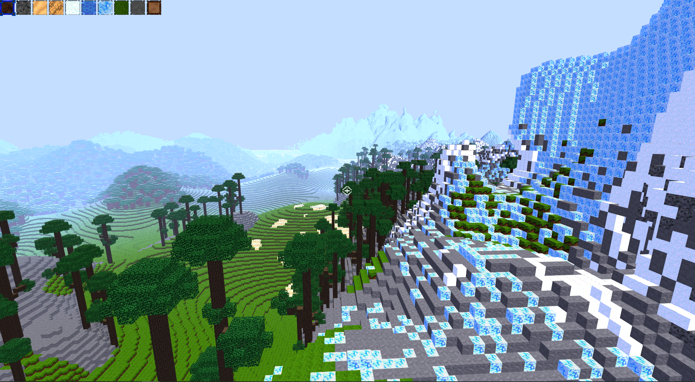
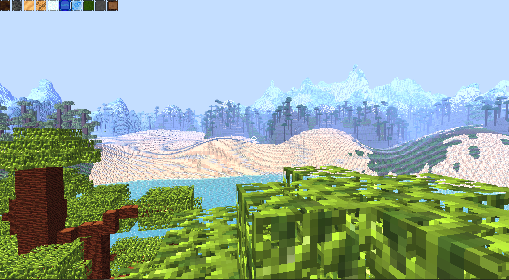
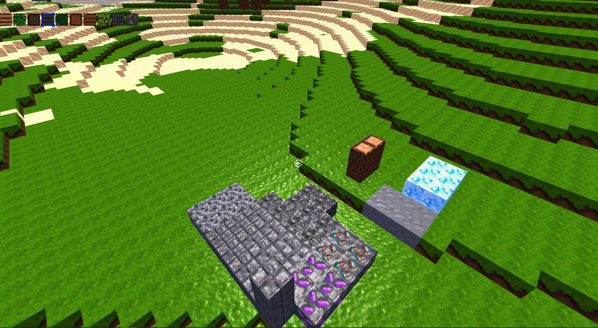

# CraftMine

CraftMine is a Minecraft Clone, written as a school Project for Computer Science.

## Features
- Fast & Optimized Chunk mesh generation
- Many different Biomes such as Snowy Mountains, Deserts, Jungles and Forests
- Multithreaded world generation
- Modern OpenGL graphics such as normal maps, fog and phong shading
- Breaking & Placing many different Blocks
- Player collisions with Terrain
- Relativly fast rendering

## Screenshots

